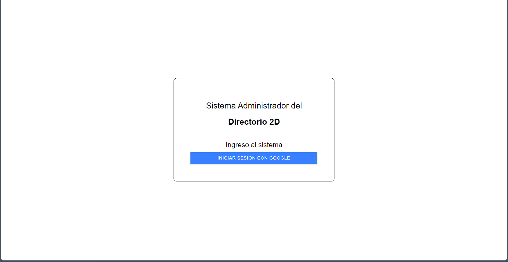
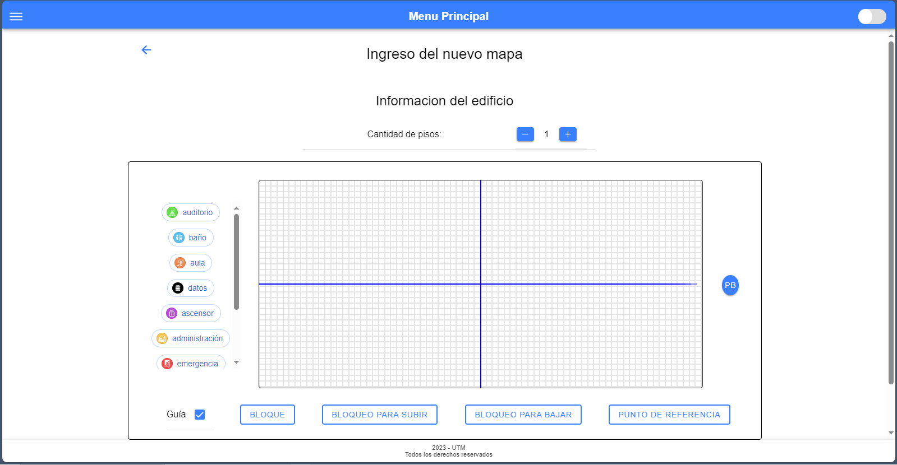

# Directorio 2D | Gestor de contenido (Version pública)
Panel administrador para gestionar el contenido que será mostrado en la aplicación móvil llamada **[Directory 2D.](https://github.com/ileosebastian/directory-2d-application)**

[Gestion de contenido del directorio 2D](https://dir-2d-administrator.web.app/).

~~~
Esta versión del proyecto tiene como finalidad enseñar a la comunidad lo que se puede hacer con angular y el elemento canvas HTML. Siendo parte de mi proyecto de grado, se sigue arquitecturas limpias y pasos necesarios para ejecutarlo, sin utilizar el entorno real backend de la aplicación.
~~~

## Fotos de muestra
### Inicio de sesión


### Menun principal 


### Editor del mapa 2D


### Editor del mapa2D con datos


### Formulario para pesonalizar punto de referencia


## Requisitos para la instalación:
- **NodeJS** v18.18.2
- **NPM** v9.8.1
- **Ionic** CLI v7.1.5
- **Angular CLI** v16.1.1, con los siguientes paquetes asociados:

    Angular: 16.1.2
    ... animations, common, compiler, compiler-cli, core, forms
    ... platform-browser, platform-browser-dynamic, router/
    - @angular-devkit/architect       v0.1601.1
    - @angular-devkit/build-angular   v16.1.1
    - @angular-devkit/core            v16.1.2
    - @angular-devkit/schematics      v16.0.3
    - @angular/cli                    v16.1.1
    - @angular/fire                   v7.6.1
    - @angular/language-service       v16.2.12
    - @schematics/angular             v16.2.12
    - rxjs                            v7.8.1
    - typescript                      v5.0.4

## Pasos para ejecutar el software
1. Tener instalado las dependencias dichas en **Requisitos para la instalacion**
2. Ejecutar el comando ```npm install``` en este directorio, para instalar las dependencias, las cuales se especifican en el archivo "project-summary.md".
3. Ejecutar el comando ```ionic serve``` el cual compilará el sitio web, levantando un servidor local para desplegar el sistema.

**Hecho por Leo Sebastian Intriago Zambrano.**